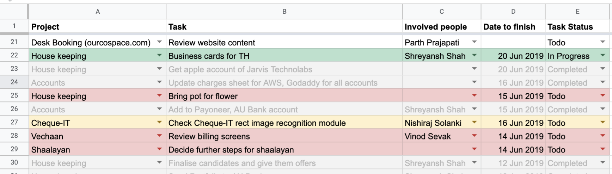

 
 

#### What does this project do?

To manage my daily tasks, I enter them in my google sheets as follows:

The sheet gets messier to understand when number of rows increase. So what I needed was a summary of tasks, so that I can easily
understand what are my delayed tasks, tasks for today and tasks whose deadline I haven't set yet.
 

Checkout how to use clasp to run this project locally [over here](https://github.com/google/clasp/blob/master/docs/run.md)

1. The function to run locally is 
